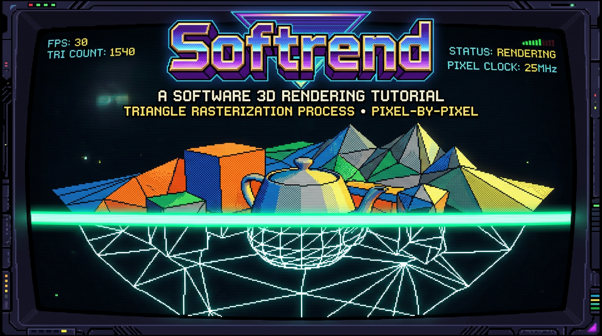

# Softrend: 3D Software Rendering from Scratch

Softrend is a minimal 3D software rasterizer in C, from blank framebuffer to textured meshes. It uses the minimal multiplatform [Fenster](https://github.com/zserge/fenster/blob/main/fenster.h) single header library for windowing and write access to the underlying system framebuffer, and Sean Barret's [STB Image](https://github.com/nothings/stb/blob/master/stb_image.h) for loading PNG texture files.

Currently I am working through the existing codebase and creating individual lessons from it. [Click here](https://turpenescire.github.io/softrend-3d/lesson_01) for the first lesson. I have a nearly complete renderer already, and I'm currently writing lesson articles detailing how I implemented each of the following features:

- OBJ + MTL model loading with multi-mesh support and UV texture mapping
- MVP transform pipeline: local → world → camera → screen
- Near-plane clipping via Sutherland-Hodgman
- Depth buffering
- Backface culling and screen-space bounding box culling
- Perspective-correct UV interpolation
- Programmable vertex and fragment shaders
- Lambert, Gouraud, Phong and textured shaders
- CPU-generated mipmapping (12 levels)
- Bilinear filtering
- Shadow mapping
- Multi-threaded tile grid based parallelism
- Particle system

